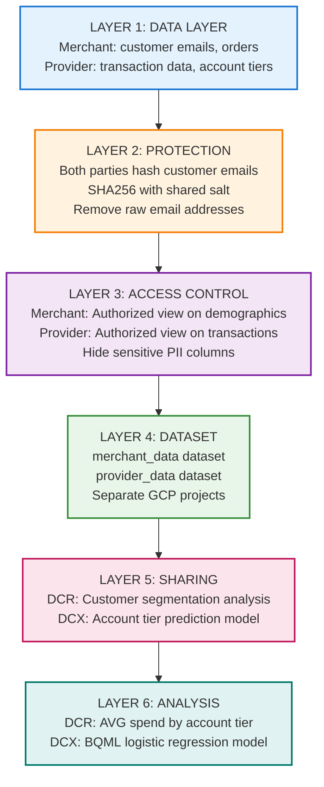
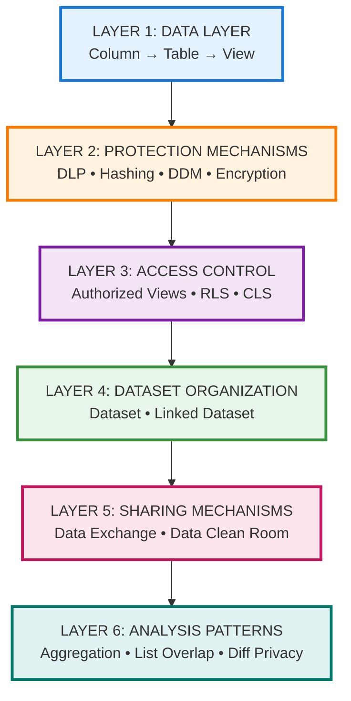
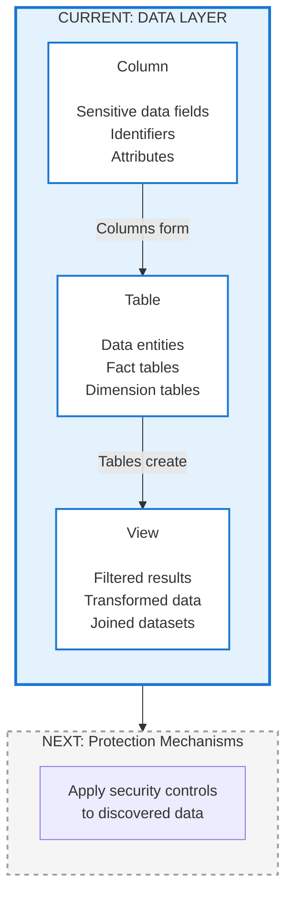
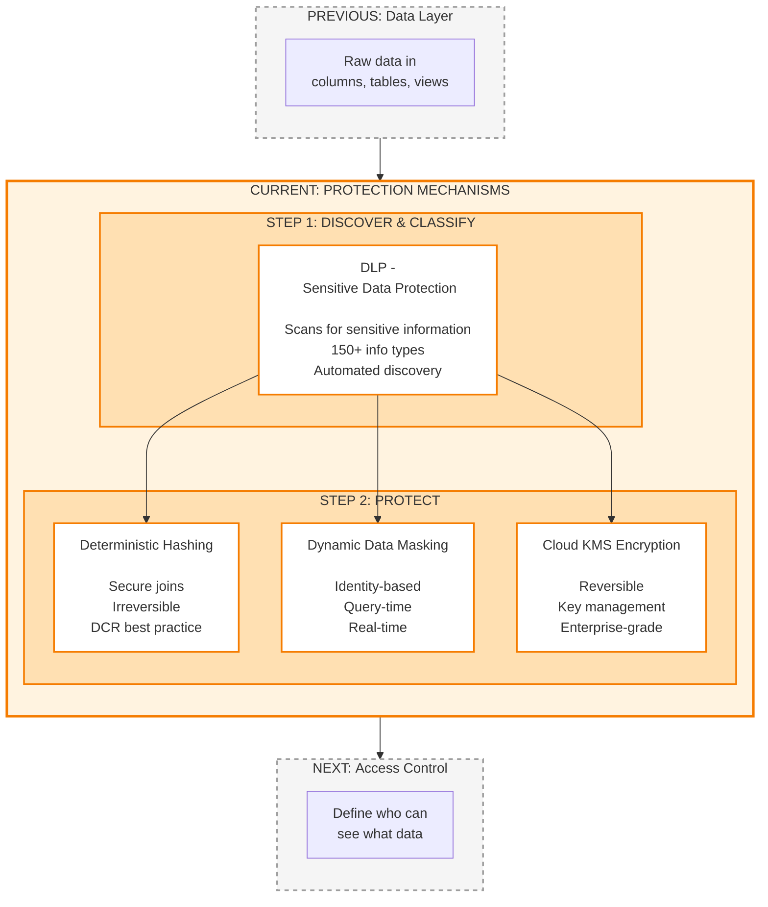
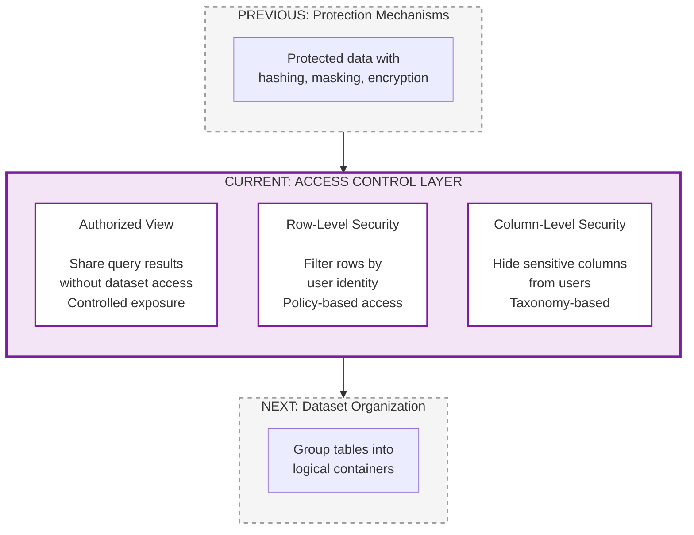
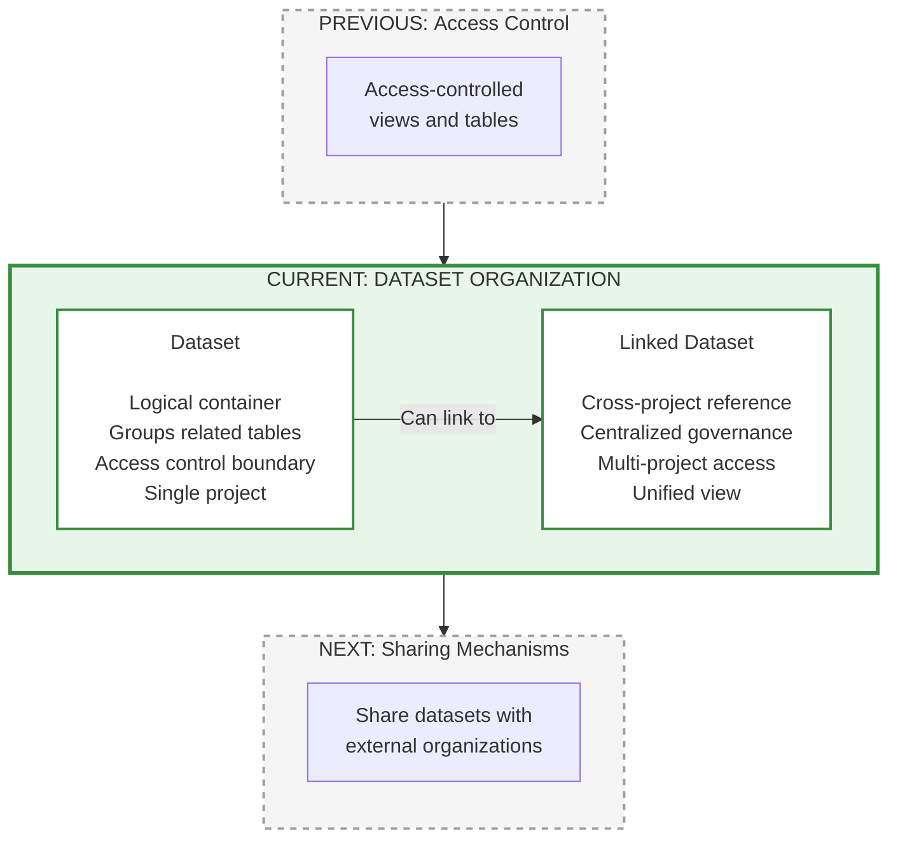
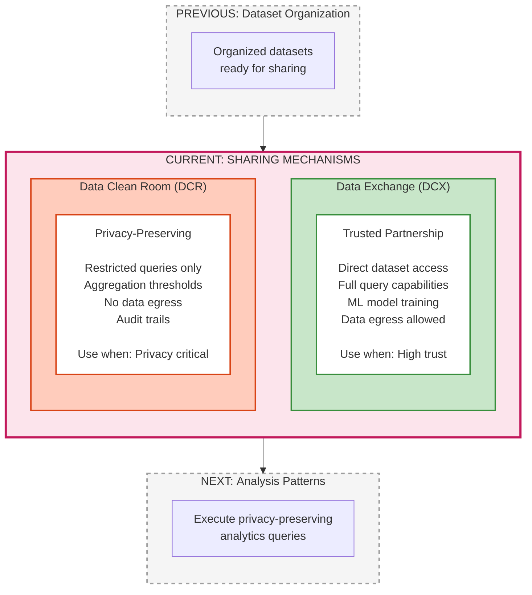
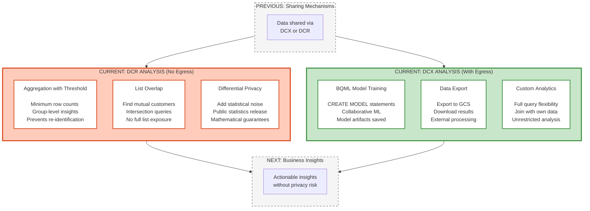

# BigQuery Data Sharing Hierarchy - Presentation Slides

This document contains presentation-ready slides for explaining BigQuery's data sharing hierarchy. Each slide focuses on a specific layer with clear connections to previous and next layers.

---

## Slide 1: Real-World Example - E-Commerce Partnership

**Title:** Use Case: Merchant & Payment Provider Collaboration

**Real-World Scenario:**

**Business Goal:** E-commerce merchant and payment provider want to collaborate on customer insights without exposing raw PII.

**DCR Roles:**
- Data Clean Room Owner: Creates and manages the DCR environment
- Data Contributors: Merchant and Provider publish their protected datasets
- Subscribers: Both parties subscribe to analyze the combined data

**Implementation:**
1. **Data Layer:** Merchant has customer demographics and purchase history. Provider has payment transactions and account tier information.
2. **Protection:** Both hash customer email addresses using SHA256 with a shared secret salt, enabling secure joins.
3. **Access Control:** Each party creates authorized views exposing only necessary columns, hiding raw PII.
4. **Dataset:** Data remains in separate GCP projects (merchant_data and provider_data) for security.
5. **Sharing:** Use DCR for privacy-preserving customer segmentation. Use DCX for collaborative ML model training. Enable subscriber email logging for audit trails.
6. **Analysis:**
   - DCR query: Calculate average spend by account tier with 50+ user threshold
   - DCX query: Train BQML model to predict which customers will upgrade to premium accounts

**Result:** Both parties gain valuable insights while protecting customer privacy and maintaining data sovereignty.

---

## Slide 2: Overview - The Complete Hierarchy

**Title:** BigQuery Data Sharing: From Columns to Clean Rooms

**Key Message:** The example you just saw flows through 6 layers of increasing abstraction, with protection applied at each stage. Let's explore each layer in detail.

---

## Slide 3: Data Layer - The Foundation

**Title:** Layer 1: Data Layer

**Key Points:**
- Column: Individual data fields containing sensitive information
- Table: Primary storage for structured data
- View: Query-based subsets without data duplication

---

## Slide 4: Protection Mechanisms - DCPA Lifecycle

**Title:** Layer 2: Protection Mechanisms

**Key Points:**
- DLP: Discovers and classifies sensitive data automatically
- Hashing: One-way transformation for secure joins
- DDM: Real-time masking based on user identity
- Encryption: Reversible protection with key management

---

## Slide 5: Access Control - Fine-Grained Security

**Title:** Layer 3: Access Control

**Key Points:**
- Authorized View: Share specific data without granting dataset permissions
- Row-Level Security: Different users see different rows automatically
- Column-Level Security: Hide sensitive columns based on user roles

---

## Slide 6: Dataset Organization - Logical Containers

**Title:** Layer 4: Dataset Organization

**Key Points:**
- Dataset: Primary organizational unit in BigQuery
- Linked Dataset: Symbolic link to shared datasets via Analytics Hub
- Sharing enabled through Analytics Hub platform

---

## Slide 7: Sharing Mechanisms - DCX vs DCR

**Title:** Layer 5: Sharing Mechanisms

**Key Points:**
- Both DCX and DCR are implemented via Analytics Hub platform
- DCX: Trusted partnerships with full data access
- DCR: Privacy-critical scenarios with restricted access

---

## Slide 8: Analysis Patterns - DCR vs DCX Analytics

**Title:** Layer 6: Analysis Patterns

**Key Points:**

**DCR Analysis (No Data Egress):**
- Aggregation: Group-level insights without individual exposure
- List Overlap: Discover mutual customers securely
- Differential Privacy: Public statistics with privacy guarantees
- Query Templates: Predefined queries for controlled analysis

**DCX Analysis (Data Egress Allowed):**
- BQML: Train ML models with CREATE MODEL statements
- Data Export: Export results to GCS or download
- Custom Analytics: Full query flexibility for trusted partners

---

## Slide 9: Key Takeaways

**Title:** Best Practices Summary

### Protection Strategy
1. Always hash sensitive identifiers for joins in DCRs
   - Use SHA256 with shared salt
   - Never join on raw identifiers

2. Layer multiple protections
   - DLP for discovery
   - DDM for internal operational analytics
   - Hashing for DCR/DCX secure joins
   - Aggregation thresholds for privacy

3. Choose the right sharing mechanism
   - DCX: Trusted ML collaboration (with data egress)
   - DCR: Privacy-critical analytics (no data egress)

### DCPA Lifecycle for Data Clean Rooms
- Discover: Use DLP to find sensitive data
- Classify: Categorize with 150+ info types
- Protect: Apply hashing + authorized views for external sharing
- Analyze: Enable secure insights through analysis rules and differential privacy
