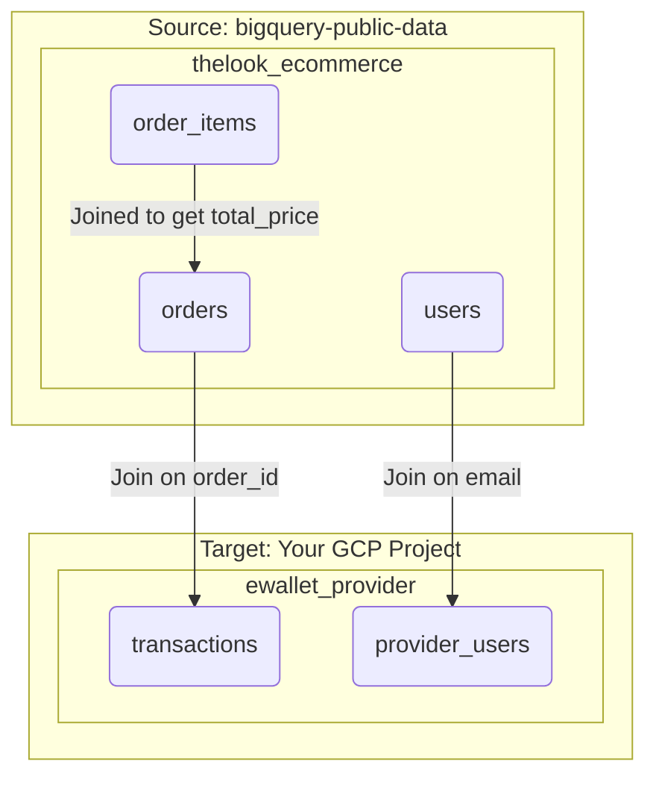

# BigQuery Data Clean Room Simulation

This project contains a Python script to generate synthetic data for a BigQuery Data Clean Room (DCR) demo. It simulates a realistic data-sharing partnership between an e-commerce merchant and an e-wallet payment provider.

The script reads from the public `bigquery-public-data.thelook_ecommerce` dataset and creates a new dataset in your own GCP project containing the payment provider's data.

## 1. Data Clean Room Use Cases

This simulation enables several powerful use cases, allowing two parties to gain mutual insights without exposing their raw, sensitive customer data to each other.

---

### Use Case 1: Transaction Verification (Merchant's Goal)

The **merchant** wants to understand which of their sales were processed by this specific e-wallet provider. This is the most fundamental DCR use case.

*   **Action:** The merchant joins their `orders` table with the provider's `transactions` table inside the DCR.
*   **Join Key:** `order_id`
*   **Example Query:**
    ```sql
    -- This query, run by the merchant, finds all of their orders
    -- that have a matching transaction record from the payment provider.
    SELECT
        m.order_id,
        m.created_at,
        p.transaction_id,
        p.transaction_amount
    FROM
        `bigquery-public-data.thelook_ecommerce.orders` AS m
    INNER JOIN
        `your-gcp-project.ewallet_provider.transactions` AS p
        ON m.order_id = p.order_id
    LIMIT 10;
    ```

---

### Use Case 2: Customer Segmentation (Merchant's Goal)

The **merchant** wants to know if customers with a higher "tier" e-wallet account spend more at their store.

*   **Action:** The merchant joins their `users` data with the provider's `provider_users` data (which contains the `account_tier`).
*   **Join Key:** `email`
*   **Example Query:**
    ```sql
    -- This query segments customers by the provider's account tier
    -- and calculates the average order value for each tier.
    SELECT
        p.account_tier,
        AVG(t.transaction_amount) AS average_order_value,
        COUNT(DISTINCT u.id) AS number_of_customers
    FROM
        `bigquery-public-data.thelook_ecommerce.users` AS u
    JOIN
        `your-gcp-project.ewallet_provider.provider_users` AS p ON u.email = p.email
    JOIN
        `your-gcp-project.ewallet_provider.transactions` AS t ON p.provider_user_id = t.provider_user_id
    GROUP BY 1
    ORDER BY 2 DESC;
    ```

---

### Use Case 3: Trust and Fraud Analysis (Merchant's Goal)

The **merchant** wants to identify high-trust customers to potentially offer them special services or credit.

*   **Action:** The merchant uses the `is_verified_user` flag from the provider's data as a signal of trustworthiness.
*   **Join Key:** `email`
*   **Example Query:**
    ```sql
    -- This query counts the number of verified vs. unverified users
    -- who have made purchases.
    SELECT
        p.is_verified_user,
        COUNT(DISTINCT u.id) AS number_of_customers
    FROM
        `bigquery-public-data.thelook_ecommerce.users` AS u
    JOIN
        `your-gcp-project.ewallet_provider.provider_users` AS p ON u.email = p.email
    GROUP BY 1;
    ```

---

### Use Case 4: User Enrichment (Provider's Goal)

The **e-wallet provider** wants to learn more about the demographics and location of their own customers who shop at this merchant.

*   **Action:** The provider joins their `provider_users` table with the merchant's `users` table.
*   **Join Key:** `email`
*   **Example Query:**
    ```sql
    -- This query, run by the provider, enriches their user data with
    -- the merchant's demographic and location information.
    SELECT
        p.provider_user_id,
        p.email,
        m.age,
        m.gender,
        m.country AS merchant_customer_country
    FROM
        `your-gcp-project.ewallet_provider.provider_users` AS p
    JOIN
        `bigquery-public-data.thelook_ecommerce.users` AS m ON p.email = m.email
    LIMIT 10;
    ```

## 2. Data Flow and Architecture

The following diagram illustrates the data flow from the public source dataset to the newly created provider dataset in your target project.



## 3. How to Run

### Prerequisites

*   Python 3.12
*   `uv` package manager installed (`pip install uv`)
*   Authenticated Google Cloud SDK on your local machine.

### Setup

1.  **Set your GCP Project ID:**
    Open `dcr_data_generator/main.py` and update the `WRITE_PROJECT_ID` variable with your Google Cloud project ID.

2.  **Create and Sync the Virtual Environment:**
    From the root of this project directory, run the following command. This will create a local virtual environment (`.venv`) and install the required dependencies (`google-cloud-bigquery`).
    ```sh
    uv sync
    ```

### Execution

Once the setup is complete, run the main script from the project's root directory:

```sh
uv run python -m dcr_data_generator.main
```

The script will handle the creation of the `ewallet_provider` dataset and its tables, truncating them first if they already exist to prevent data duplication.

## 4. Generated Schemas

The script will create the following tables in the `ewallet_provider` dataset within your target GCP project.

#### `provider_users`
| Column Name        | Data Type | Description                                                     |
| ------------------ | --------- | --------------------------------------------------------------- |
| `provider_user_id` | `INTEGER` | The provider's unique internal identifier for a user.           |
| `email`            | `STRING`  | The user's email, serving as the join key for enrichment.      |
| `date_of_birth`    | `DATE`    | Synthetically generated date of birth.                          |
| `city`             | `STRING`  | **Sourced directly from the merchant's `users` table.**         |
| `account_tier`     | `STRING`  | The user's account level with the provider (e.g., 'Free', 'Premium'). |
| `is_verified_user` | `BOOLEAN` | Indicates if the user has completed KYC with the provider.      |


#### `transactions`
| Column Name           | Data Type | Description                                                  |
| --------------------- | --------- | ------------------------------------------------------------ |
| `transaction_id`      | `STRING`  | A unique identifier for the payment transaction.             |
| `order_id`            | `INTEGER` | The join key linking back to the merchant's `orders` table.  |
| `provider_user_id`    | `INTEGER` | A foreign key linking to the provider's internal `provider_users` table. |
| `transaction_amount`  | `FLOAT64` | **Sourced from the sum of `sale_price` in `order_items`.**   |
| `transaction_timestamp` | `TIMESTAMP` | **Sourced from the `created_at` field in `orders`.**         |
| `status`              | `STRING`  | **Sourced directly from the `status` field in `orders`.**    |
