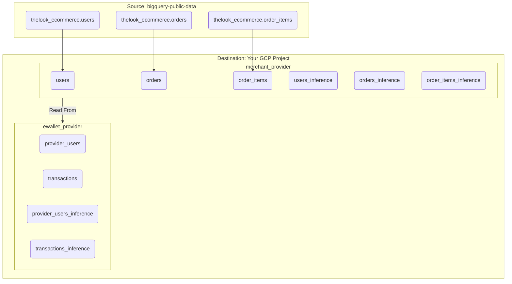

# BigQuery Data Clean Room Simulation

This project contains a Python script to generate synthetic data for a BigQuery Data Clean Room (DCR) demo. It simulates a realistic data-sharing partnership between an e-commerce merchant and an e-wallet payment provider.

The script first creates a clean, isolated snapshot of source data from `bigquery-public-data.thelook_ecommerce` into your own GCP project. It then uses this clean snapshot to generate the synthetic provider data. This ensures the demo is reproducible and resilient to changes in the public dataset.

## 1. Architecture: A Two-Step Process

The data generation pipeline is a two-step process designed for robustness and data integrity.

**Step 1: Create Merchant Snapshot**
A clean, de-duplicated copy of the merchant's data is created in a new `merchant_provider` dataset within your GCP project. This involves copying data for a specific date and de-duplicating user records.

**Step 2: Generate E-Wallet Provider Data**
The script then reads from the clean snapshot to generate the `ewallet_provider` dataset. This process is run twice with different dates to create separate datasets for training and inference.



## 2. Data Clean Room Use Cases (Analytics)

This simulation enables several powerful analytics use cases. All example queries should be run against the tables created in **your own GCP project**.

---

### Use Case 1: Transaction Verification (Merchant's Goal)

The **merchant** wants to understand which of their sales were processed by this specific e-wallet provider.

*   **Action:** The merchant joins their `orders` table with the provider's `transactions` table.
*   **Join Key:** `order_id`
*   **DCR Analysis Rule:** **List Overlap** - This query identifies the intersection of two datasets (merchant's orders and provider's transactions) based on a common key. The DCR returns only the overlapping identifiers, protecting both parties' full datasets while allowing the merchant to identify which of their orders were processed by this provider.
*   **Example Query:**
    ```sql
    -- This query returns the list of order_ids that exist in both datasets,
    -- demonstrating a classic "list overlap" scenario in a data clean room.
    SELECT DISTINCT
        m.order_id
    FROM
        `your-merchant-project.merchant_provider.orders` AS m
    INNER JOIN
        `your-provider-project.ewallet_provider.transactions` AS p
        ON m.order_id = p.order_id;
    ```

---

### Use Case 2: Customer Segmentation (Merchant's Goal)

The **merchant** wants to know if customers with a higher "tier" e-wallet account spend more at their store.

*   **Action:** The merchant joins their `users` table with the provider's `provider_users` table, their own `orders` table, and the provider's `transactions` table.
*   **Join Keys:** `email`, `user_id`, and `order_id`
*   **DCR Analysis Rule:** **Aggregation with Threshold** - This query groups data by a dimension (`account_tier`) and calculates aggregate metrics (`AVG`, `COUNT`). The DCR will automatically apply aggregation thresholds, filtering out any groups with fewer than the minimum required number of users (typically 50+) to prevent re-identification of individuals.
*   **Example Query:**
    ```sql
    -- This query segments customers by the provider's account tier
    -- and calculates the average order value for each tier.
    -- Results will only show tiers with sufficient user counts to meet privacy thresholds.
    SELECT
        p.account_tier,
        AVG(t.transaction_amount) AS average_order_value,
        COUNT(DISTINCT u.id) AS number_of_customers
    FROM
        `your-merchant-project.merchant_provider.users` AS u
    JOIN
        `your-provider-project.ewallet_provider.provider_users` AS p ON u.email = p.email
    JOIN
        `your-merchant-project.merchant_provider.orders` AS o ON u.id = o.user_id
    JOIN
        `your-provider-project.ewallet_provider.transactions` AS t ON o.order_id = t.order_id
    GROUP BY 1
    HAVING COUNT(DISTINCT u.id) >= 50  -- Example threshold for demo purposes
    ORDER BY 2 DESC;
    ```

---

### Use Case 3: Trust and Fraud Analysis (Merchant's Goal)

The **merchant** wants to identify high-trust customers.

*   **Action:** The merchant joins their `users` table with the provider's `provider_users` table to analyze the `is_verified_user` flag.
*   **Join Key:** `email`
*   **DCR Analysis Rule:** **Aggregation with Threshold** - This query groups users by their verification status and counts them. Like Use Case 2, the DCR will apply aggregation thresholds to ensure that both groups (verified and unverified) have sufficient user counts to protect individual privacy.
*   **Example Query:**
    ```sql
    -- This query counts the number of verified vs. unverified users
    -- who have made purchases. Results will only show if both groups
    -- meet the minimum threshold requirements.
    SELECT
        p.is_verified_user,
        COUNT(DISTINCT u.id) AS number_of_customers
    FROM
        `your-merchant-project.merchant_provider.users` AS u
    JOIN
        `your-provider-project.ewallet_provider.provider_users` AS p ON u.email = p.email
    GROUP BY 1
    HAVING COUNT(DISTINCT u.id) >= 50;  -- Example threshold for demo purposes
    ```

---

### Use Case 4: User Enrichment (Provider's Goal)

The **e-wallet provider** wants to learn more about their customers who shop at this merchant.

*   **Action:** The provider joins their `provider_users` table with the merchant's `users` table.
*   **Join Key:** `email`
*   **DCR Analysis Rule:** **List Overlap** - This query identifies the intersection of the provider's customers and the merchant's customers, returning enriched demographic data for the overlapping users. The DCR ensures that only users who exist in both datasets are returned, protecting the privacy of non-overlapping customers from both sides.
*   **Example Query:**
    ```sql
    -- This query returns demographic enrichment data for users who exist
    -- in both the provider's and merchant's datasets, demonstrating list overlap.
    SELECT DISTINCT
        p.provider_user_id,
        m.age,
        m.gender,
        m.country AS merchant_customer_country,
        m.traffic_source
    FROM
        `your-provider-project.ewallet_provider.provider_users` AS p
    JOIN
        `your-merchant-project.merchant_provider.users` AS m ON p.email = m.email;
    ```

---

## 3. Advanced Use Case: Collaborative ML with BQML

This section demonstrates a realistic and powerful machine learning use case where the **e-wallet provider** leverages the **merchant's** rich demographic data to build a more accurate predictive model than they could alone.

### BQML Use Case: Predicting High-Tier Customers (Provider's Goal)

*   **Business Goal:** The e-wallet provider wants to identify which of their customers are most likely to upgrade to a 'Premium' or 'Business' account tier. This allows them to target marketing campaigns for premium services more effectively and increase revenue through upselling.

*   **The Data Clean Room Advantage:**
    *   The **e-wallet provider** has basic account information about their users: `account_tier` and `is_verified_user`.
    *   The **merchant** has rich demographic and behavioral data: `age`, `gender`, `state`, `country`, `traffic_source`, and shopping patterns.
    *   In the DCR, the provider can **enrich their limited data** with the merchant's rich demographic signals by joining on the common `email` key. This allows them to build a much more accurate customer segmentation model without either side exposing their full customer datasets.

*   **ML Approach:** The provider will train a **classification model** to predict `account_tier`. The workflow is as follows:
    1.  The provider joins their `provider_users` table with the merchant's `users` table on `email`.
    2.  They use the merchant's rich demographic features (`age`, `gender`, `state`, `traffic_source`) as predictive signals.
    3.  They use their own `account_tier` as the label to predict.
    4.  The trained model is saved back into the provider's project for their own use.

*   **Collaborative ML Workflow:**
    ```mermaid
    graph TD
        subgraph MerchantProject [Merchant's GCP Project]
            direction TB
            Users(merchant_provider.users)
        end

        subgraph ProviderProject [Provider's GCP Project]
            direction TB
            ProviderUsers(ewallet_provider.provider_users)
            Model(Account Tier Predictor)
        end

        subgraph DCR [Data Clean Room]
            direction TB
            CreateModel[CREATE MODEL]
        end

        Users -- "email" --> CreateModel
        ProviderUsers -- "email, account_tier" --> CreateModel

        CreateModel -- "Saves to" --> Model

        style DCR fill:#e6f2ff,stroke:#0066cc,stroke-width:2px,stroke-dasharray: 5 5
    ```

*   **Example `CREATE MODEL` Query (using training data):**
    This query joins the provider's user table with the merchant's rich demographic data to build a powerful feature set. The label `account_tier` comes from the provider's own data.
    ```sql
    CREATE OR REPLACE MODEL `your-provider-project.ewallet_provider.account_tier_predictor`
    OPTIONS(model_type='LOGISTIC_REG', input_label_cols=['account_tier']) AS
    SELECT
      -- Features from the merchant's rich demographic data
      m.age,
      m.gender,
      m.state,
      m.country,
      m.traffic_source,
      -- Label from the provider's own data
      p.account_tier
    FROM
      `your-provider-project.ewallet_provider.provider_users` p
    JOIN
      `your-merchant-project.merchant_provider.users` m ON p.email = m.email;
    ```

*   **Example `ML.PREDICT` Query (using inference data):**
    The provider can now use this model to predict the likely account tier of new customers from the inference dataset.
    ```sql
    SELECT
      provider_user_id,
      email,
      predicted_account_tier,
      predicted_account_tier_probs
    FROM
      ML.PREDICT(MODEL `your-provider-project.ewallet_provider.account_tier_predictor`,
        (
          SELECT
            p.provider_user_id,
            p.email,
            m.age,
            m.gender,
            m.state,
            m.country,
            m.traffic_source
          FROM
            `your-provider-project.ewallet_provider.provider_users_inference` p
          JOIN
            `your-merchant-project.merchant_provider.users_inference` m ON p.email = m.email
        )
      );
    ```

## 4. How to Run

### Prerequisites

*   Python 3.12
*   `uv` package manager installed
*   Authenticated Google Cloud SDK on your local machine.

### Setup

1.  **Create and Sync the Virtual Environment:**
    From the root of this project directory, run `uv sync`. This creates a local `.venv` and installs the required dependencies.

2.  **Set your GCP Project IDs:**
    You must provide two separate GCP project IDs - one for the merchant's data and one for the e-wallet provider's data. This simulates the real-world scenario where each entity maintains their data in separate projects.

### Execution

Run the main script from the project's root directory. This single command will generate **both** the training and inference datasets.

```sh
uv run python -m dcr_data_generator.main --merchant-project-id your-merchant-project --provider-project-id your-provider-project
```

## 5. Generated Schemas

The script creates tables in two datasets across your separate GCP projects.

### `merchant_provider` (Clean Snapshot) - Created in Merchant's Project
This dataset will contain two sets of tables, one for training and one for inference.
*   **Training Tables:** `orders`, `order_items`, `users`
*   **Inference Tables:** `orders_inference`, `order_items_inference`, `users_inference`

### `ewallet_provider` (Synthetic Data) - Created in Provider's Project
This dataset will contain two sets of tables:
*   **Training Tables:** `provider_users` and `transactions`.
*   **Inference Tables:** `provider_users_inference` and `transactions_inference`.

#### `provider_users`
| Column Name        | Data Type | Description                                                     |
| ------------------ | --------- | --------------------------------------------------------------- |
| `provider_user_id` | `INTEGER` | The provider's unique internal identifier for a user.           |
| `email`            | `STRING`  | The user's email, serving as the join key for enrichment.      |
| `date_of_birth`    | `DATE`    | Synthetically generated date of birth.                          |
| `city`             | `STRING`  | **Sourced directly from the merchant's `users` table.**         |
| `account_tier`     | `STRING`  | The user's account level with the provider (e.g., 'Free', 'Premium'). |
| `is_verified_user` | `BOOLEAN` | Indicates if the user has completed KYC with the provider.      |

#### `transactions`
| Column Name           | Data Type | Description                                                  |
| --------------------- | --------- | ------------------------------------------------------------ |
| `transaction_id`      | `STRING`  | A unique identifier for the payment transaction.             |
| `order_id`            | `INTEGER` | The join key linking back to the merchant's `orders` table.  |
| `provider_user_id`    | `INTEGER` | A foreign key linking to the provider's internal `provider_users` table. |
| `transaction_amount`  | `FLOAT64` | **Sourced from the sum of `sale_price` in `order_items`.**   |
| `transaction_timestamp` | `TIMESTAMP` | **Sourced from the `created_at` field in `orders`.**         |
| `status`              | `STRING`  | **Sourced directly from the `status` field in `orders`.**    |
