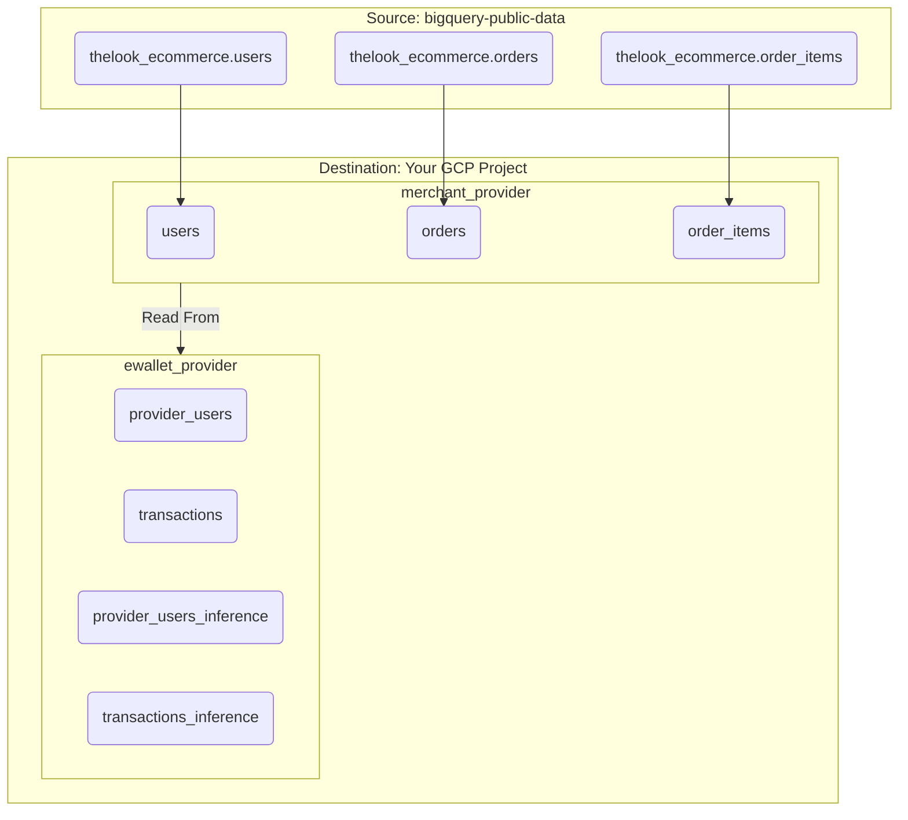

# BigQuery Data Clean Room Simulation

This project contains a Python script to generate synthetic data for a BigQuery Data Clean Room (DCR) demo. It simulates a realistic data-sharing partnership between an e-commerce merchant and an e-wallet payment provider.

The script first creates a clean, isolated snapshot of source data from `bigquery-public-data.thelook_ecommerce` into your own GCP project. It then uses this clean snapshot to generate the synthetic provider data. This ensures the demo is reproducible and resilient to changes in the public dataset.

## 1. Architecture: A Two-Step Process

The data generation pipeline is a two-step process designed for robustness and data integrity.

**Step 1: Create Merchant Snapshot**
A clean, de-duplicated copy of the merchant's data is created in a new `merchant_provider` dataset within your GCP project. This involves:
1.  Copying `orders` and `order_items` for a specific date.
2.  Identifying the unique users from those orders and copying only their most recent, de-duplicated records into a new `users` table.

**Step 2: Generate E-Wallet Provider Data**
The script then reads from the clean `merchant_provider` snapshot to generate the `ewallet_provider` dataset, which contains the synthetic data for the payment provider. This process is run twice to create separate datasets for training and inference.



## 2. Data Clean Room Use Cases

This simulation enables several powerful use cases. All example queries should be run against the tables created in **your own GCP project**.

---

### Use Case 1: Transaction Verification (Merchant's Goal)

The **merchant** wants to understand which of their sales were processed by this specific e-wallet provider.

*   **Action:** The merchant joins their `orders` table (from the `merchant_provider` snapshot) with the provider's `transactions` table.
*   **Join Key:** `order_id`
*   **Example Query:**
    ```sql
    -- This query, run by the merchant, finds all of their orders
    -- that have a matching transaction record from the payment provider.
    SELECT
        m.order_id,
        m.created_at,
        p.transaction_id,
        p.transaction_amount
    FROM
        `your-gcp-project.merchant_provider.orders` AS m
    INNER JOIN
        `your-gcp-project.ewallet_provider.transactions` AS p
        ON m.order_id = p.order_id
    LIMIT 10;
    ```

---

### Use Case 2: Customer Segmentation (Merchant's Goal)

The **merchant** wants to know if customers with a higher "tier" e-wallet account spend more at their store.

*   **Action:** The merchant joins their `users` data with the provider's `provider_users` data.
*   **Join Key:** `email`
*   **Example Query:**
    ```sql
    -- This query segments customers by the provider's account tier
    -- and calculates the average order value for each tier.
    SELECT
        p.account_tier,
        AVG(t.transaction_amount) AS average_order_value,
        COUNT(DISTINCT u.id) AS number_of_customers
    FROM
        `your-gcp-project.merchant_provider.users` AS u
    JOIN
        `your-gcp-project.ewallet_provider.provider_users` AS p ON u.email = p.email
    JOIN
        `your-gcp-project.ewallet_provider.transactions` AS t ON p.provider_user_id = t.provider_user_id
    GROUP BY 1
    ORDER BY 2 DESC;
    ```

---

### Use Case 3: BQML - Predicting Customer Value (Merchant's Goal)

The **merchant** wants to predict the lifetime value (LTV) of their customers by using the provider's data as predictive features.

*   **Action:** Train a regression model using the combined data.
*   **Example `CREATE MODEL` Query (using training data):**
    ```sql
    CREATE OR REPLACE MODEL `your-gcp-project.ewallet_provider.clv_predictor`
    OPTIONS(model_type='BOOSTED_TREE_REGRESSOR', input_label_cols=['total_spend']) AS
    SELECT
      p.account_tier,
      p.is_verified_user,
      u.age,
      u.gender,
      SUM(t.transaction_amount) AS total_spend
    FROM
      `your-gcp-project.merchant_provider.users` u
    JOIN
      `your-gcp-project.ewallet_provider.provider_users` p ON u.email = p.email
    JOIN
      `your-gcp-project.ewallet_provider.transactions` t ON p.provider_user_id = t.provider_user_id
    GROUP BY 1, 2, 3, 4;
    ```
*   **Example `ML.PREDICT` Query (using inference data):**
    ```sql
    SELECT
      *
    FROM
      ML.PREDICT(MODEL `your-gcp-project.ewallet_provider.clv_predictor`,
        (
          SELECT
            p.account_tier,
            p.is_verified_user,
            u.age,
            u.gender
          FROM
            `your-gcp-project.merchant_provider.users` u
          JOIN
            `your-gcp-project.ewallet_provider.provider_users_inference` p ON u.email = p.email
        )
      );
    ```

## 3. How to Run

### Prerequisites

*   Python 3.12
*   `uv` package manager installed
*   Authenticated Google Cloud SDK on your local machine.

### Setup

1.  **Create and Sync the Virtual Environment:**
    From the root of this project directory, run `uv sync`. This creates a local `.venv` and installs the required dependencies.

2.  **Set your GCP Project ID (Optional):**
    The script defaults to `johanesa-playground-326616`. You can override this by passing the `--project-id` flag during execution.

### Execution

Run the main script from the project's root directory. This single command will generate **both** the training and inference datasets.

```sh
uv run python -m dcr_data_generator.main --project-id your-gcp-project
```

## 4. Generated Schemas

The script creates tables in two datasets within your target GCP project.

### `merchant_provider` (Clean Snapshot)
This dataset will contain two sets of tables, one for training and one for inference.
*   **Training Tables:** `orders`, `order_items`, `users`
*   **Inference Tables:** `orders_inference`, `order_items_inference`, `users_inference`

### `ewallet_provider` (Synthetic Data)
This dataset will contain two sets of tables:
*   **Training Tables:** `provider_users` and `transactions`.
*   **Inference Tables:** `provider_users_inference` and `transactions_inference`.

#### `provider_users`
| Column Name        | Data Type | Description                                                     |
| ------------------ | --------- | --------------------------------------------------------------- |
| `provider_user_id` | `INTEGER` | The provider's unique internal identifier for a user.           |
| `email`            | `STRING`  | The user's email, serving as the join key for enrichment.      |
| `date_of_birth`    | `DATE`    | Synthetically generated date of birth.                          |
| `city`             | `STRING`  | **Sourced directly from the merchant's `users` table.**         |
| `account_tier`     | `STRING`  | The user's account level with the provider (e.g., 'Free', 'Premium'). |
| `is_verified_user` | `BOOLEAN` | Indicates if the user has completed KYC with the provider.      |

#### `transactions`
| Column Name           | Data Type | Description                                                  |
| --------------------- | --------- | ------------------------------------------------------------ |
| `transaction_id`      | `STRING`  | A unique identifier for the payment transaction.             |
| `order_id`            | `INTEGER` | The join key linking back to the merchant's `orders` table.  |
| `provider_user_id`    | `INTEGER` | A foreign key linking to the provider's internal `provider_users` table. |
| `transaction_amount`  | `FLOAT64` | **Sourced from the sum of `sale_price` in `order_items`.**   |
| `transaction_timestamp` | `TIMESTAMP` | **Sourced from the `created_at` field in `orders`.**         |
| `status`              | `STRING`  | **Sourced directly from the `status` field in `orders`.**    |
